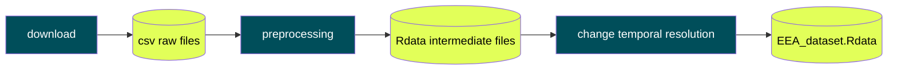

# Introduction

The goal of the GRINS (Growing Resiliant INclusive and Sustainable) project is to help the Italian community to grow efficiently as well as resilient, inclusive and sustainable. This important and challenging goal will be reached thank to the deeper comprehension of the reality. Data are the mirror of reality, but they must be collected, validated, re-organised, harmonised, analysed, visualised and finally interpreted. Statistical tools are the only instruments capable of performing these operations on the data, so they are indispensable for achieving the goals of the GRINS project.

The team of the University of Bergamo (UNIBG) involved in the spoke 0, more specifically in the Work Package 0.2 (WP0.2), leaded by Prof. Alessandro Fassò, is proposing to use a common methodology for data harmonisation among the groups of the project. In particular, these methods are suitable for spatial and temporal data. UNIBG works mainly with environmental data: weather, air quality and emissions. Harmonised data, with the same spatial and temporal resolution (i.e. municipality and daily), will compose the dataset used by the AMELIA platform. More specifically, this dataset will represent the deliverable D.0.2.1 of the GRINS project.

# Air Quality data (AQ)

Air quality data are usually **observed** or **modeled**. **Observed** data represent the measurements made by operators and machines. They reflect the best approximation of the reality but they are prone to missingness, measurement errors, heterogeneity among measurements procedures, sparse availability, and other issues. **Modeled** data, on the other hand, generally show completeness and uniformity but they can significantly differ from the reality. Almost all mathematical models generating modeled data are divided in two different categories: **deterministic** and **stochastic**.

For the Italian domain, we retrieve AQ data from two different sources: the European Environmental Agency (**EEA**) and the Copernicus Atmosphere Monitoring Service (**CAMS**). **EEA** data are **observed** from the air quality monitoring stations and **CAMS** data are based on an ensemble of nine air quality data assimilation systems across Europe that use CTMs as based. Technical details about the sources are contained in the download sections [EEA 1: Download](#EEA-1-Download) and [CAMS 1: Download](#CAMS-1-Download), respectively. EEA data are available just at specific locations (the air quality monitoring network) while CAMS products are available on a full grid (cell centers lie on orthogonal straight lines) and cropped over the Italian domain. To use both the EEA and CAMS data simultaneously, data fusion techniques are required. 

## European Environmental Agency (EEA)

The following section contains the operations made on the EEA data:
1. [Download](#EEA-1-Download)
2. [Preprocess](#EEA-2-Preprocessing)
3. [Change of temporal resolution](#EEA-3-Change-of-temporal-resolution)

The following diagram summarises the process.

The process makes extensive use of the functions contained in the [`functions.R`](script/AQ/EEA/functions.R) script.
