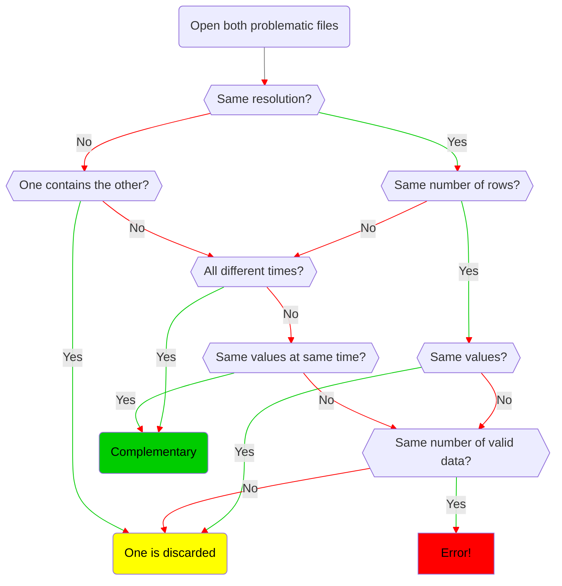
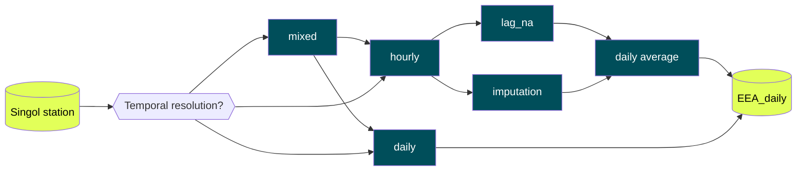

# AQ-EEA/v.1.0.0

The following section illustrates the operations to reproduce the AQ-EEA v.1.0.0 dataset:
1. [Download](#EEA-1-Download)
2. [Preprocess](#EEA-2-Preprocessing)
3. [Change of temporal resolution](#EEA-3-Change-of-temporal-resolution)

The following diagram summarises the process.

The process makes extensive use of the functions contained in the [`functions.R`](script/AQ/EEA/functions.R) script.

### EEA 1: Download

The first script is [`EEA_download.R`](v.1.0.0/script/AQ/EEA/EEA_download.R). This script makes the request about air pollutants concentrations to the [Air Quality Portal](https://aqportal.discomap.eea.europa.eu) ([download link](https://eeadmz1-cws-wp-air02-dev.azurewebsites.net/download-data/)) managed by the European Environmental Agency (EEA). The request is made for the following pollutants:

| | CO | NH3 | NMVOC | NO | NO2 | O3 | PM10 | PM2.5 | SO2 |
| --- | --- | --- | --- | --- | --- | --- | --- | --- | --- |
| **EEA Code** | 10 | 35 | 33 | 38 | 8 | 7 | 5 | 6001 | 1 |

Data available in that service come from two dataflows: E1a and E2a. The E1a data are reported to EEA by memberstates every September and covers the year before the delivery. This means that data delivered in September 2023 covers 2022. However, they are not immediatly available. At the moment of our access (12 April 2024) the E1a covers the period until 2021, included. EEA also receives up-to-date (E2a) data with a delay of few weeks (2-3 weeks). Because E1a data are validated and considered an official delivery, all E2a data are deleted before E1a data are imported. This is to ensure that no E2a data are mixed with E1a data. E2a files for the current year are updated once a day. 

From the script `EEA_download.R` raw data are collected in *csv* files in the [raw folder](v.1.0.0/data/AQ/EEA/raw), each of them corresponding to one station, one pollutant, one year. 

### EEA 2: Preprocessing

The raw files downloaded in the [EEA 1: Download](#EEA-1-Download) need to be preprocessed in order to be accessible for modelling. The preprocessing procedure is contained in the `EEA_preprocessing.R`. This script makes the following steps:
1. Identify problematic files (e.g. same station, pollutant and time in two different files)
2. Pass from raw table in *csv* files into cleaned dataframe stored in *Rdata* files
3. Bind all the station within the same year for the same pollutant into unique dataframes
4. Summary analysis of the data
5. Anomalies detection and subset the dataset after selected thresholds

#### EEA 2.1: Identifying problematic files

Within the raw files, there are some issues, e.g. duplicated measurements (same hours), or two different raw *csv* files contain the same station for the same pollutant and the same period. An automatic procedure address these problems: the script [`classify_problematic_rawfiles.R`](v.1.0.0/script/AQ/EEA/preprocessing/classify_problematic_rawfiles.R), described in the [Figure 2.1.1](#class_raw), makes the detection and classification of each case. The output of this procedure are in the folder [processing](v.1.0.0/data/AQ/EEA/processing): 
1. *list_raw_files.Rdata* with all input files along with some characteristics
2. *double_stations.Rdata* with the different files overlapping
3. *duplicated_raw_files.Rdata* with files containing duplicate measurements
4. *removing_files.Rdata* files that need to be discarded
5. *complementary_files.Rdata* files that contains complementary information

*Figure 2.1.1 Automatic procedure for the detection and removal of problematic raw files*

#### EEA 2.2: Lighter and cleaned tables from *csv* to *Rdata* files

After have identified the problematic files, all the raw *csv* files are opened and some adjustments are made on the table: useless columns are dropped, characters field are converted to numeric, time variable is treated as timedate suitable for R. Then, each station for one year and one pollutant is saved as a dataframe in *Rdata* format and they are contained in the [1s_1p_1y](v.1.0.0/data/AQ/EEA/1s_1p_1y) folder.

#### EEA 2.3: Binding all stations for same year and pollutant

Information contained in the *Rdata* files within the [1s_1p_1y](v.1.0.0/data/AQ/EEA/preprocessing/1s_1p_1y) folder (one station, one year, one pollutant), are binded togheter to form single dataframe for each year and pollutant. These new dataframes (including all the stations) are contained in the *Rdata* files within the [1p_1y](v.1.0.0/data/AQ/EEA/preprocessing/1p_1y) folder.

#### EEA 2.4: Summary analysis of the data

In *Table 2.4.1* is reported the number of observations grouped by pollutants along with the information about the number of observations, the number of stations, percentage of missing values. In *Table 2.4.2* the type of measurement is reported, hourly, bi-hourly and daily. In *Table 2.4.3* the validity flag is reported: number of missing values, -99 for not valid due to station maintenance or calibration, -1 if not valid, 1 if valid, 2 if valid but below detection limit measurement value and 3 if valid, but below detection limit and number replaced by 0.5\*detection limit given ([reference link](http://dd.eionet.europa.eu/vocabulary/aq/observationvalidity/view)). In *Table 2.4.4* the verification flag is reported: number of missing values, 1 when the observation id verified, 2 for preliminary verification, 3 if not verified ([reference link](http://dd.eionet.europa.eu/vocabulary/aq/observationverification/view)). In *Table 2.4.5* the period covered by each pollutant.

*Table 2.4.1: An overview of the data . Concentration_NA are expressed as % of the total*
|       | n_obs    | n_staz | Concentration_NA |
|-------|----------|--------|------------------|
| CO    | 18283915 | 268    | 6.6e+00          |
| NH3   | 47990    | 1      | 1.2e+01          |
| NO2   | 53069874 | 711    | 6.7e+00          |
| NO    | 12937098 | 336    | 6.0e+00          |
| O3    | 29044368 | 402    | 6.0e+00          |
| PM10  | 10227992 | 649    | 8.7e+00          |
| PM2.5 | 5061802  | 351    | 9.3e+00          |
| SO2   | 18639687 | 274    | 8.3e+00          |

*Table 2.4.2: Temporal resolution of measurements (expressed as % of the total)*
|       | time_1h | time_2h | time_24h |
|-------|---------|---------|----------|
| CO    | 1.0e+02 | 1.5e-03 | 0.0e+00  |
| NH3   | 1.0e+02 | 8.3e-03 | 0.0e+00  |
| NO2   | 1.0e+02 | 5.1e-03 | 0.0e+00  |
| NO    | 1.0e+02 | 9.9e-04 | 0.0e+00  |
| O3    | 1.0e+02 | 1.7e-03 | 0.0e+00  |
| PM10  | 8.1e+01 | 4.0e+00 | 1.5e+01  |
| PM2.5 | 8.4e+01 | 3.5e-03 | 1.6e+01  |
| SO2   | 1.0e+02 | 1.4e-03 | 0.0e+00  |

*Table 2.4.3: Validity flag of measurements (expressed as % of the total)*
|       | validity_NA | validity_neg99 | validity_neg1 | validity_1 | validity_2 | validity_3 |
|-------|-------------|----------------|---------------|------------|------------|------------|
| CO    | 0.0e+00     | 6.1e-01        | 6.0e+00       | 8.2e+01    | 2.8e+00    | 8.6e+00    |
| NH3   | 0.0e+00     | 5.4e+00        | 6.5e+00       | 8.8e+01    | 0.0e+00    | 0.0e+00    |
| NO2   | 3.8e-06     | 6.9e-01        | 6.0e+00       | 8.7e+01    | 3.0e+00    | 3.4e+00    |
| NO    | 0.0e+00     | 6.5e-01        | 5.3e+00       | 7.3e+01    | 1.4e+01    | 6.7e+00    |
| O3    | 0.0e+00     | 7.9e-01        | 5.2e+00       | 8.8e+01    | 2.0e+00    | 4.4e+00    |
| PM10  | 0.0e+00     | 3.2e-01        | 8.3e+00       | 8.1e+01    | 5.3e-01    | 9.8e+00    |
| PM2.5 | 0.0e+00     | 4.0e-01        | 8.9e+00       | 8.1e+01    | 3.1e-01    | 9.7e+00    |
| SO2   | 0.0e+00     | 6.0e-01        | 7.7e+00       | 7.3e+01    | 5.2e+00    | 1.3e+01    |

*Table 2.4.4: Verification flag of measurements (expressed as % of the total)*
|       | verification_NA | verification_1 | verification_2 | verification_3 |
|-------|-----------------|----------------|----------------|----------------|
| CO    | 0.0e+00         | 8.5e+01        | 1.5e+00        | 1.3e+01        |
| NH3   | 0.0e+00         | 1.8e+01        | 0.0e+00        | 8.2e+01        |
| NO2   | 3.8e-06         | 8.3e+01        | 1.9e+00        | 1.5e+01        |
| NO    | 0.0e+00         | 9.1e+01        | 9.1e-01        | 8.3e+00        |
| O3    | 0.0e+00         | 8.3e+01        | 1.9e+00        | 1.5e+01        |
| PM10  | 0.0e+00         | 7.8e+01        | 2.4e+00        | 2.0e+01        |
| PM2.5 | 0.0e+00         | 7.5e+01        | 3.0e+00        | 2.2e+01        |
| SO2   | 0.0e+00         | 8.5e+01        | 1.9e+00        | 1.3e+01        |

*Table 2.4.5: The period covered by the data, for each pollutant*
|       | Datetime_NA | Datetime_start | Datetime_end | years_covered                                               |
|-------|-------------|----------------|--------------|-------------------------------------------------------------|
| CO    | 0E+00       | 2012-12-31     | 2023-12-30   | 2013/2012/2014/2015/2016/2017/2018/2019/2020/2021/2022/2023 |
| NH3   | 0E+00       | 2013-12-31     | 2023-12-30   | 2014/2013/2018/2019/2020/2021/2022/2023                     |
| NO2   | 0E+00       | 2012-12-31     | 2023-12-30   | 2013/2012/2014/2015/2016/2017/2018/2019/2020/2021/2022/2023 |
| NO    | 0E+00       | 2012-12-31     | 2023-12-30   | 2013/2012/2014/2016/2017/2018/2019/2020/2021/2022/2023      |
| O3    | 0E+00       | 2012-12-31     | 2023-12-30   | 2013/2012/2014/2015/2016/2017/2018/2019/2020/2021/2022/2023 |
| PM10  | 0E+00       | 2012-12-31     | 2023-12-30   | 2013/2012/2014/2015/2016/2017/2018/2019/2020/2021/2022/2023 |
| PM2.5 | 0E+00       | 2012-12-31     | 2023-12-30   | 2013/2012/2014/2015/2016/2017/2018/2019/2020/2021/2022/2023 |
| SO2   | 0E+00       | 2012-12-31     | 2023-12-30   | 2013/2012/2014/2015/2016/2017/2018/2019/2020/2021/2022/2023 |

#### EEA 2.5: Anomalies detection and removal

At the beginning of the anomalies detection procedure, the "verification" flag is analysed in order to find if it contains useful information to be used within the anomalies detection procedure. In particular, for every pollutant, the distribution conditioned to the flag is reported in *Table 2.5.1*. The quantities reported are: the name of the pollutant and its verification flag (i.e. pollutant_flag), number of valid measurements belonging to the category (%), number of missing (validity -1 and -99 and negative numbers) in %, minimum, first quartile, median, mean, third quartile, maximum, standard deviation. This analysis aims to highlight possible common behavior inside the same category of verification flag, but it is not happened. We expected to find anomalies in the last category (verification flag = 3, not verified) however this is not the case. Moreover, the standard deviation calculated on the flag 1 (verified) is similar to the standard deviation calculated on the overall distribution. The usage of the verification flag for the anomalies detection is therefore discarded.

For the detection and the removal of outliers the first approach is to use a multiple of the standard deviation (e.g. 4 $\sigma$), made on the overall distribution (2013-2023, all stations) of each pollutant separately. The usage of the z-score assume that the process is Gaussian and its probability distribution can be approximated by a normal. However, air quality concentrations, often fail to be normally distributed, oftenly skewness to the left, with a long tail on the right. To overcome this problem, the same procedure have been applied to the data transformed using the log-transformation. Calculated sigma and the number of observations that would be discarded increasing the multipliers of sigma are shown il *Table 2.5.2*. However, this approach lead to very different results among the pollutants, for instance the particulate matter discarded using 6 $\sigma$ are less than NO2, the opposite happens applying the same method on log-transformed data.

The second approach used is to individuate the thresholds using the percentiles of the overall disitrbution, in particular the 99%, 99.9%, 99.99% and 99.999% percentiles are used. The overall statistics of these subsets, in particular the mean, the standard deviation, the absolute value of the threshold, the number of observation outside and the number of stations affected. To better understand anomalies values, histograms of observations outside according to these thresholds, are displayed and coloured by the station. The target is to identify possible clusters within the same station. An example of these visual representation is displayed in *figure 2.5.1* where extreme values of PM2.5 (over 10*k* $\micro g m^{-3}$) are recorded in two different stations, located in Alessandria (CN) and Papariano (UD) where these values are irrealistic and to be considered incorrect.

Considering jointly the tables and the histograms, fixed thresholds are decided and listed in *Table 2.5.4*. After this thresholds, values are considered anomalies and dropped from the dataset.

*Table 2.5.1: Analysis of the verification flag among pollutants over the entire period*
| Pol_flag| n       | n_NA    | Min.    | 1st Qu. | Median  | Mean    | 3rd Qu. | Max.    | sd      |
|---------|---------|---------|---------|---------|---------|---------|---------|---------|---------|
| CO      | 1.0e+00 | 8.3e-02 | 0.0e+00 | 2.4e-01 | 4.0e-01 | 5.1e-01 | 6.4e-01 | 2.1e+02 | 5.2e-01 |
| CO_1    | 8.5e-01 | 8.6e-02 | 0.0e+00 | 2.4e-01 | 4.0e-01 | 5.1e-01 | 6.6e-01 | 2.1e+02 | 5.2e-01 |
| CO_2    | 1.6e-02 | 2.4e-02 | 1.0e-02 | 2.6e-01 | 4.3e-01 | 5.1e-01 | 6.5e-01 | 9.9e+00 | 3.6e-01 |
| CO_3    | 1.3e-01 | 6.5e-02 | 0.0e+00 | 2.4e-01 | 3.9e-01 | 4.7e-01 | 6.0e-01 | 5.8e+01 | 5.3e-01 |
| NH3     | 1.0e+00 | 1.2e-01 | 1.0e-01 | 4.2e+00 | 5.6e+00 | 5.8e+00 | 7.0e+00 | 4.8e+01 | 2.7e+00 |
| NH3_1   | 1.3e-01 | 3.6e-01 | 1.0e-01 | 2.3e+00 | 3.2e+00 | 3.4e+00 | 4.4e+00 | 1.6e+01 | 1.9e+00 |
| NH3_2   | 0.0e+00 |     NaN |      NA |      NA |      NA |     NaN |      NA |      NA |      NA |
| NH3_3   | 8.7e-01 | 6.7e-02 | 5.0e-01 | 4.7e+00 | 5.8e+00 | 6.1e+00 | 7.3e+00 | 4.8e+01 | 2.7e+00 |
| NO2     | 1.0e+00 | 7.3e-02 | 0.0e+00 | 7.2e+00 | 1.6e+01 | 2.2e+01 | 3.1e+01 | 9.9e+03 | 2.0e+01 |
| NO2_1   | 8.3e-01 | 7.6e-02 | 0.0e+00 | 7.5e+00 | 1.6e+01 | 2.3e+01 | 3.2e+01 | 9.9e+03 | 2.1e+01 |
| NO2_2   | 2.0e-02 | 3.1e-02 | 2.0e-02 | 8.0e+00 | 1.5e+01 | 2.0e+01 | 2.7e+01 | 2.4e+02 | 1.7e+01 |
| NO2_3   | 1.5e-01 | 6.1e-02 | 0.0e+00 | 6.1e+00 | 1.3e+01 | 1.8e+01 | 2.5e+01 | 1.6e+03 | 1.7e+01 |
| NO      | 1.0e+00 | 1.6e-01 | 0.0e+00 | 1.4e+00 | 3.0e+00 | 1.2e+01 | 1.0e+01 | 6.4e+04 | 3.8e+01 |
| NO_1    | 9.0e-01 | 1.7e-01 | 0.0e+00 | 1.5e+00 | 3.0e+00 | 1.2e+01 | 1.0e+01 | 6.4e+04 | 3.9e+01 |
| NO_2    | 1.0e-02 | 3.3e-02 | 1.0e-02 | 6.2e-01 | 2.6e+00 | 1.3e+01 | 1.3e+01 | 3.6e+02 | 2.5e+01 |
| NO_3    | 8.8e-02 | 1.1e-01 | 1.0e-02 | 1.4e+00 | 3.0e+00 | 8.4e+00 | 7.0e+00 | 5.9e+02 | 1.7e+01 |
| O3      | 1.0e+00 | 6.4e-02 | 0.0e+00 | 2.8e+01 | 5.7e+01 | 5.7e+01 | 8.1e+01 | 3.2e+03 | 3.5e+01 |
| O3_1    | 8.3e-01 | 6.6e-02 | 0.0e+00 | 2.7e+01 | 5.6e+01 | 5.6e+01 | 8.1e+01 | 2.7e+03 | 3.5e+01 |
| O3_2    | 1.9e-02 | 3.3e-02 | 2.0e-02 | 3.0e+01 | 6.0e+01 | 6.0e+01 | 8.5e+01 | 3.2e+02 | 3.6e+01 |
| O3_3    | 1.5e-01 | 5.7e-02 | 0.0e+00 | 3.1e+01 | 5.9e+01 | 5.8e+01 | 8.2e+01 | 3.2e+03 | 3.5e+01 |
| PM10    | 1.0e+00 | 8.9e-02 | 0.0e+00 | 1.2e+01 | 1.9e+01 | 2.5e+01 | 2.9e+01 | 2.5e+06 | 1.3e+03 |
| PM10_1  | 7.8e-01 | 8.4e-02 | 0.0e+00 | 1.2e+01 | 1.9e+01 | 2.5e+01 | 2.9e+01 | 9.7e+05 | 1.2e+03 |
| PM10_2  | 2.6e-02 | 4.9e-02 | 1.0e-02 | 1.1e+01 | 1.7e+01 | 2.0e+01 | 2.6e+01 | 2.3e+02 | 1.4e+01 |
| PM10_3  | 1.9e-01 | 1.2e-01 | 1.0e-03 | 1.3e+01 | 2.0e+01 | 2.6e+01 | 3.0e+01 | 2.5e+06 | 2.0e+03 |
| PM2.5   | 1.0e+00 | 1.0e-01 | 1.0e-03 | 7.4e+00 | 1.2e+01 | 1.6e+01 | 1.9e+01 | 7.3e+05 | 3.6e+02 |
| PM2.5_1 | 7.6e-01 | 8.5e-02 | 1.0e-02 | 7.4e+00 | 1.2e+01 | 1.5e+01 | 1.9e+01 | 1.2e+03 | 1.3e+01 |
| PM2.5_2 | 3.1e-02 | 7.1e-02 | 1.0e-02 | 5.7e+00 | 1.0e+01 | 1.3e+01 | 1.7e+01 | 1.5e+02 | 1.0e+01 |
| PM2.5_3 | 2.1e-01 | 1.5e-01 | 1.0e-03 | 7.6e+00 | 1.2e+01 | 1.7e+01 | 1.9e+01 | 7.3e+05 | 7.8e+02 |
| SO2     | 1.0e+00 | 1.1e-01 | 0.0e+00 | 9.8e-01 | 2.3e+00 | 3.5e+00 | 4.1e+00 | 1.4e+06 | 4.0e+02 |
| SO2_1   | 8.4e-01 | 1.2e-01 | 0.0e+00 | 9.0e-01 | 2.3e+00 | 3.5e+00 | 4.1e+00 | 1.4e+06 | 4.4e+02 |
| SO2_2   | 2.0e-02 | 4.7e-02 | 1.0e-02 | 1.5e+00 | 3.0e+00 | 3.7e+00 | 5.0e+00 | 3.4e+02 | 3.3e+00 |
| SO2_3   | 1.4e-01 | 9.6e-02 | 0.0e+00 | 1.0e+00 | 2.2e+00 | 3.1e+00 | 4.0e+00 | 2.6e+03 | 1.0e+01 |

*Table 2.5.2 Number of observations (%) fallen outside thresholds identified by multipliers of* $\sigma$
|            | sd      | out_1sd | out_2sd | out_3sd | out_4sd | out_5sd | out_6sd |
|------------|---------|---------|---------|---------|---------|---------|---------|
| CO         | 5.2e-01 | 8.3e-02 | 2.5e-02 | 9.0e-03 | 3.5e-03 | 1.4e-03 | 7.5e-04 |
| log(CO)    | 1.3e-01 | 6.0e-02 | 4.0e-02 | 2.6e-02 | 1.7e-02 | 1.1e-02 | 6.5e-03 |
| NH3        | 2.7e+00 | 1.1e-01 | 3.1e-02 | 1.0e-02 | 4.6e-03 | 2.3e-03 | 1.5e-03 |
| log(NH3)   | 5.0e-01 | 1.1e-01 | 9.6e-03 | 1.3e-03 | 2.4e-04 | 0.0e+00 | 0.0e+00 |
| NO2        | 2.0e+01 | 1.5e-01 | 5.0e-02 | 1.6e-02 | 4.7e-03 | 1.4e-03 | 4.4e-04 |
| log(NO2)   | 1.0e+00 | 1.7e-01 | 3.1e-03 | 5.0e-06 | 3.9e-07 | 2.0e-07 | 4.1e-08 |
| NO         | 3.8e+01 | 5.7e-02 | 2.3e-02 | 1.0e-02 | 5.1e-03 | 2.5e-03 | 1.3e-03 |
| log(NO)    | 1.3e+00 | 1.8e-01 | 4.8e-02 | 2.2e-03 | 4.9e-06 | 9.2e-07 | 5.5e-07 |
| O3         | 3.5e+01 | 1.6e-01 | 2.6e-02 | 3.4e-03 | 3.6e-04 | 5.9e-05 | 2.8e-05 |
| log(O3)    | 1.1e+00 | 5.1e-02 | 1.8e-05 | 7.0e-07 | 3.7e-08 | 0.0e+00 | 0.0e+00 |
| PM10       | 1.3e+03 | 1.2e-05 | 9.6e-06 | 9.0e-06 | 8.7e-06 | 8.1e-06 | 7.7e-06 |
| log(PM10)  | 7.3e-01 | 1.4e-01 | 1.5e-02 | 9.2e-04 | 6.0e-05 | 2.2e-05 | 1.2e-05 |
| PM2.5      | 3.6e+02 | 2.0e-04 | 1.8e-04 | 2.4e-05 | 3.7e-06 | 3.1e-06 | 2.9e-06 |
| log(PM2.5) | 7.6e-01 | 1.5e-01 | 2.1e-02 | 9.7e-04 | 2.3e-04 | 1.9e-04 | 2.4e-05 |
| SO2        | 4.0e+02 | 1.2e-05 | 5.5e-06 | 4.4e-06 | 2.5e-06 | 2.4e-06 | 1.9e-06 |
| log(SO2)   | 7.7e-01 | 1.8e-01 | 2.7e-02 | 2.7e-03 | 6.0e-04 | 1.2e-04 | 2.9e-05 |

*Table 2.5.3 Summary statistics of subsets identified by percentiles as thresholds (99%, 99.9%, 99.99%, 99.999%). Avg indicates the mean, sd the standard deviatiom, thr the value used as thresholds, out the number of observations (as %) left outside and n the number of stations affected*
|         | CO      | NH3     | NO2     | NO      | O3      | PM10    | PM2.5   | SO2     |
|---------|---------|---------|---------|---------|---------|---------|---------|---------|
| avg_all | 5.1e-01 | 5.8e+00 | 2.2e+01 | 1.2e+01 | 5.7e+01 | 2.5e+01 | 1.6e+01 | 3.5e+00 |
| sd_all  | 5.2e-01 | 2.7e+00 | 2.0e+01 | 3.8e+01 | 3.5e+01 | 1.3e+03 | 3.6e+02 | 4.0e+02 |
| thr_1   | 2.0e+00 | 1.4e+01 | 8.9e+01 | 1.3e+02 | 1.4e+02 | 8.7e+01 | 6.5e+01 | 1.5e+01 |
| out_1   | 1.8e+05 | 4.2e+02 | 4.9e+05 | 1.1e+05 | 2.7e+05 | 9.4e+04 | 4.6e+04 | 1.7e+05 |
| n_1     | 2.6e+02 | 1.0e+00 | 6.3e+02 | 2.6e+02 | 3.9e+02 | 6.0e+02 | 2.5e+02 | 2.6e+02 |
| avg_1   | 4.8e-01 | 5.7e+00 | 2.1e+01 | 1.0e+01 | 5.6e+01 | 2.2e+01 | 1.5e+01 | 2.9e+00 |
| sd_1    | 3.4e-01 | 2.3e+00 | 1.8e+01 | 1.8e+01 | 3.4e+01 | 1.5e+01 | 1.1e+01 | 2.6e+00 |
| thr_2   | 3.4e+00 | 2.6e+01 | 1.3e+02 | 2.6e+02 | 1.8e+02 | 1.6e+02 | 1.1e+02 | 3.8e+01 |
| out_2   | 1.7e+04 | 4.3e+01 | 4.9e+04 | 1.1e+04 | 2.7e+04 | 9.3e+03 | 4.6e+03 | 1.7e+04 |
| n_2     | 2.1e+02 | 1.0e+00 | 4.7e+02 | 1.8e+02 | 3.0e+02 | 3.4e+02 | 1.5e+02 | 2.0e+02 |
| avg_2   | 5.0e-01 | 5.8e+00 | 2.2e+01 | 1.1e+01 | 5.7e+01 | 2.3e+01 | 1.5e+01 | 3.1e+00 |
| sd_2    | 3.8e-01 | 2.6e+00 | 1.9e+01 | 2.3e+01 | 3.5e+01 | 1.7e+01 | 1.2e+01 | 3.1e+00 |
| thr_3   | 6.5e+00 | 4.1e+01 | 1.7e+02 | 4.2e+02 | 2.2e+02 | 2.8e+02 | 9.8e+02 | 1.2e+02 |
| out_3   | 1.7e+03 | 5.0e+00 | 4.9e+03 | 1.1e+03 | 2.7e+03 | 9.3e+02 | 7.3e+02 | 1.7e+03 |
| n_3     | 1.2e+02 | 1.0e+00 | 2.6e+02 | 7.9e+01 | 2.0e+02 | 1.2e+02 | 1.3e+01 | 1.1e+02 |
| avg_3   | 5.0e-01 | 5.8e+00 | 2.2e+01 | 1.2e+01 | 5.7e+01 | 2.3e+01 | 1.5e+01 | 3.1e+00 |
| sd_3    | 4.0e-01 | 2.7e+00 | 2.0e+01 | 2.5e+01 | 3.5e+01 | 1.7e+01 | 1.4e+01 | 3.6e+00 |
| thr_4   | 4.4e+01 | 4.8e+01 | 2.5e+02 | 6.4e+02 | 5.0e+02 | 2.5e+03 | 1.3e+03 | 4.4e+02 |
| out_4   | 1.7e+02 | 2.0e+00 | 4.9e+02 | 1.1e+02 | 2.7e+02 | 9.4e+01 | 4.7e+01 | 1.7e+02 |
| n_4     | 5.0e+00 | 1.0e+00 | 7.0e+01 | 1.6e+01 | 4.5e+01 | 9.0e+00 | 6.0e+00 | 4.5e+01 |
| avg_4   | 5.1e-01 | 5.8e+00 | 2.2e+01 | 1.2e+01 | 5.7e+01 | 2.3e+01 | 1.5e+01 | 3.1e+00 |
| sd_4    | 4.2e-01 | 2.7e+00 | 2.0e+01 | 2.5e+01 | 3.5e+01 | 1.8e+01 | 1.8e+01 | 4.0e+00 |

 

*Figure 2.5.1 histograms of PM2.5 observations excluded by the thresholds identified by the 99.99% percentile (left) and 99.999% percentile (right). Coloured according to the monitoring station*

*Table 2.5.4 thresholds selected*
| Pollutant | Thresholds |
|---------------|----------------|
| CO            | 100            |
| NH3           | 50             |
| NO            | 1000           |
| NO2           | 1000           |
| O3            | 1000           |
| PM10          | 2630           |
| PM2.5         | 980            |
| SO2           | 10000          |

### EEA 3: Change of temporal resolution

The change of the temporal resolution is made by the [`EEA_HtoD.R`](v.1.0.0/script/AQ/EEA/EEA_HtoD.R) script. This script takes in input the subsetted data after the anomalies detection and removal as described in [EEA 2.5: Anomalies detection and removal](#EEA-25-Anomalies-detection-and-removal) and convert the temporal resolution of the observations into daily data. to retain as much information as possible, the daily minimum, 1st quartile, mean, median, 3rd quartile and maximum are kept from hourly data. Moreover, to avoid distortions in the calculation of these indices, missing hourly data are imputed with the Kalman smoother. However, for days with more than 5 consecutive missing hourly data, the day is considered as missing. The functioning is described below:

After the convertion to daily data the file *EEA_dataset.Rdata* is created containing all the stations and all the day from 2013 to 2023 with for every pollutants concentrations measured the summary statistics (min, 1st quartile, mean, median, 3rd quartile, maximum). The merge is made by the script [`EEA_merging.R`](v.1.0.0/script/AQ/EEA/EEA_merging.R).
